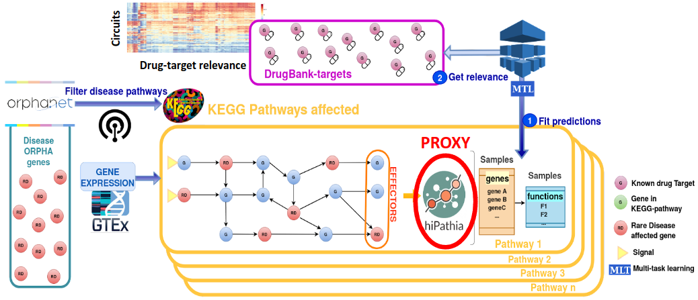

DRExM³L Drug REpurposing using Mechanistic Models of signal transduction and eXplainable Machine Learning 
=========================================================================================================

DRExM³L or drexml is a Python package for finding links between Known Drug Targets (KDTs) 
and signaling circuits.

   Holistic Drug REpurposing Model

Installation
=============

You can install drexml using:

.. code::

   pip install git+https://github.com/loucerac/drexml.git@master

Getting started
===============

DRExML is a Python software package that allows you to explore and contextualize the pharmacological landscape of a disease characterized by its signaling circuits.

Mechanistic modeling allows us to analyze the activity of signaling circuits that constitute biological pathways from gene expression data. This package uses machine learning models to infer the potential regulatory properties of known drug targets (KDTs) in these signaling circuits. This exploration of drug landscape from the disease map allows the identification of significantly influential KDT-targeting drugs that could play a therapeutic role in that disease.

The user can upload information about their disease to build their mechanistic map (see Input). The package contains information on the gene expression levels normalized by the edgeR package of the KDTs (from GTEx Analysis Release V8; dbGaP 110 Accession phs000424.v8.p2) ) and the drugs that interact with each KDT (from DrugBank version 05.01.10). Finally, default signal transduction values are computed using the Hipathia package (version 2.14.0).

For more information on the command line interface, check the :ref:`cli-reference`.

.. toctree::
   :maxdepth: 2
   :hidden:

   cli-reference

Default transcriptomic profiles are obtained from the GTEx portal (GTEx Analysis Release V8; dbGaP 110 Accession phs000424.v8.p2) and normalized using the edgeR package (version 3.40.0). Default KDTs are obtained from the DrugBank database (version 05.01.10). Finally, default signal transduction values are computed using the Hipathia package (version 2.14.0).

For more information, check the :ref:`api-reference`.

.. toctree::
   :maxdepth: 2
   :hidden:

   api_reference

Highlights
==========

- Obtain a list of KDTs which show a considerable influence over a given disease map
- Quick visualization of the knowledge: generation of figures and tables of results

Input
=====

The disease definition file is the main point of entry to interact with the software. Here, variables are defined pertaining to the disease map and activity matrix, as well as to the KDTs explored. 

Main variables pertaining to the construction of the disease map and activity matrix are:

- seed_genes: list of Entrez identifiers of genes suspected to be involved in the disease. The algorithm returns KEGG subpathways which contain at least on of these genes as the disease map
- disease_id: UMLS CUI disease identifiers. The algorithm returns genes associated to this disease using the curated DISGENET database and returns the KEGG subpathways which contain at least one of these genes as the disease map
- circuits: list of circuits to map or a path to a TSV file containing these circuits

Note that users can use different signal transduction algorithms and/or different KDT transcriptomic profiles to explore. These must be given as TSV files by providing a path to the activity matrix through the "pathvals" variable and to the KDTs through the "gene_exp" variable. 

Output
======
Software outputs are stored as TSV files:

- shap_summary_symbol.tsv: final relevance matrix (SHAP values attributed to KDTs)
- shap_selection_symbol.tsv: binary matrix indicating the KDTs have been selected for a given circuit or not
- stability_results_symbol.tsv: R2 and stability estimates of circuits along with their confidence intervals

Visualization
=============
The plot sub-command can be used to generate a number of summary graphics. Funcionalities include "plot_metrics" through which R2 and stability estimates can be visualized and "plot_relevance_heatmap" through which a heat map of the KDT SHAP scores can be generated in order to visualize KDT relevance over circuits. 

For more information on the command line interface, check the :ref:`cli-reference`.

.. toctree::
   :maxdepth: 2
   :hidden:

   cli-reference

For more information on the authors, check the :ref:`authors-reference`.

.. toctree::
   :maxdepth: 2
   :hidden:

   authors-reference

Indices and tables
==================

* :ref:`genindex`
* :ref:`modindex`
* :ref:`search`
